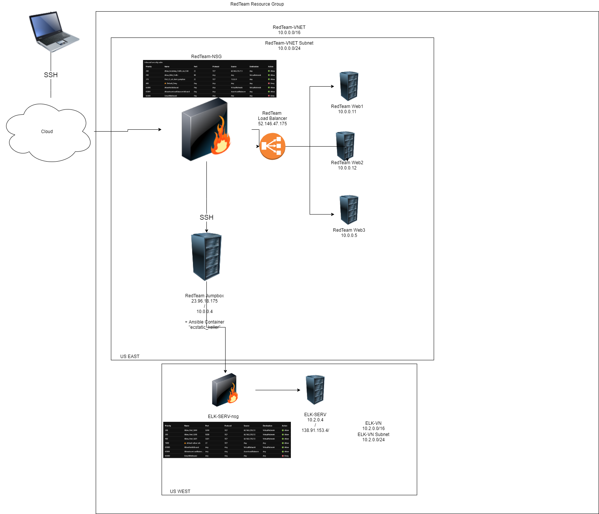

  ## Automated ELK Stack Deployment

The files in this repository were used to configure the network depicted below.

These files have been tested and used to generate a live ELK deployment on Azure. They can be used to either recreate the entire deployment pictured above. Alternatively, select portions of the playbook file may be used to install only certain pieces of it, such as Filebeat.

This document contains the following details:
- Description of the Topology
- Access Policies
- ELK Configuration
  - Beats in Use
  - Machines Being Monitored
- How to Use the Ansible Build

### Description of the Topology

The main purpose of this network is to expose a load-balanced and monitored instance of DVWA, the D*mn Vulnerable Web Application.

Load balancing ensures that the application will be highly available, in addition to restricting unauthorized access to the network.

Load balancers protect the availability of the data by distributing the load across multiple servers.
This can help protect against attacks affecting the availability of the servers and their data, such as Denial of Service (DoS) attacks. The advantage of a jump box is to limit access to servers that are not accessible from the internet, except thru the jump box. 

Integrating an ELK server allowed me to easily monitor the vulnerable VMs for changes to the server metrics and system logs. Two applications for doing so are Filebeat and Metricbeat. Filebeat records system logs, such as logon attempts while Metricbeat records metric data, such as cpu usage.

The configuration details of each machine may be found below.
I used the [Markdown Table Generator](http://www.tablesgenerator.com/markdown_tables) to create the following table.

| Name            | Function               | IP Address              | Operating System              |
|-----------------|------------------------|-------------------------|-------------------------------|
| RedTeam-Jumpbox | Gateway                | 23.96.18.175 / 10.0.0.4 | Linux Ubuntu Server 18.04 LTS |
| ELK-SERV        | ELK Server             | 10.2.0.4                | Linux Ubuntu Server 18.04 LTS |
| RedTeam-Web1    | DVWA Server            | 10.0.0.11               | Linux Ubuntu Server 18.04 LTS |
| RedTeam-Web2    | DVWA Redundancy Server | 10.0.0.12               | Linux Ubuntu Server 18.04 LTS |
| RedTeam-Web3    | DVWA Redundancy Server | 10.0.0.5                | Linux Ubuntu Server 18.04 LTS |

### Access Policies

The machines on the internal network are not exposed to the public Internet. 

Only the gateway machine can accept connections from the Internet. Access to this machine is only allowed from the following IP addresses:

68.160.239.213

Machines within the network can only be accessed by the RedTeam-Jumpbox gateway machine at 10.0.0.4.

A summary of the access policies in place can be found in the table below.

| Name            | Publicly Accessible | Allowed IP Addresses |
|-----------------|---------------------|----------------------|
| RedTeam-Jumpbox | Yes                 | 68.160.239.213       |
| ELK-SERV        | Yes                 | 68.160.239.213       |
| RedTeam-Web1    | No                  | 10.0.0.4             |
| RedTeam-Web2    | No                  | 10.0.0.4             |
| RedTeam-Web3    | No                  | 10.0.0.4             |

### Elk Configuration

Ansible was used to automate configuration of the ELK machine. No configuration was performed manually, which is advantageous because it ensures consistency across the board, and that you would not have to worry about individual configurations being the same.

The ansible playbook implements the following tasks:

1) Install docker
2) Install Python3-pip
3) Install the docker using pip3
4) Increase virtual memory
5) Download and launch the elk:761 docker web container
   and allowed the following published ports to be permitted access:
       5601:5601
       9200:9200
       5044:5044
6) Enable the docker service
   
The following screenshot displays the result of running `docker ps` after successfully configuring the ELK instance.

### Target Machines & Beats
This ELK server is configured to monitor the following machines:

| Name         | IP Address |
|--------------|------------|
| RedTeam-Web1 | 10.0.0.11  |
| RedTeam-Web2 | 10.0.0.12  |
| RedTeam-Web3 | 10.0.0.5   |

We have installed the following Beats on these machines:

Filebeat and Metricbeat

These Beats allow us to collect the following information from each machine:

Filebeat forwards and centralizes log data from your target machines.  It monitors the log files that you specify, ie. server logs such as login attempts. It collects the log events, then forwards the data to the ELK server.  

Metricbeat collects the machine metrics and statistical data, such as CPU usage, memory usage and inbound/outbound traffic and sends the data to the ELK server.

### Using the Playbook
In order to use the playbook, you will need to have an Ansible control node already configured. Assuming you have such a control node provisioned: 

SSH into the control node and follow the steps below:  
- Copy the configuration and playbook YAML files, to the /etc/ansible/files folder using:  
cp ./Resources/filebeat-config.yml /etc/ansible/files/filebeat-config.yml  
cp ./Resources/filebeat-play.yml /etc/ansible/files/filebeat-play.yml  
cp ./Resources/metricbeat-config.yml /etc/ansible/files/metricbeat-config.yml  
cp ./Resources/metricbeat-play.yml /etc/ansible/files/metricbeat-play.yml  
cp ./Resources/install-ELK.yml /etc/ansible/files/install-ELK.yml  

- Update the filebeat-config and metricbeat-config files each to point towards the ELK server IP address, username and password. (10.2.0.4, elastic & changeme, respectively, for both config files)

- Update the /etc/ansible/hosts file with two separate sections for the private server IP addresses of the ELK server and the webservers on the internal network. (see above for IP addresses)
    configure two sections:
    [webservers]
    [elkservers]

- Run the filebeat and metricbeat playbooks, and ssh into each webserver (10.0.0.11, 10.0.0.12, and 
10.0.0.5, respectively) and run "curl localhost/setup.php" to verify installation worked.  
    enter: ssh azureuser@server-ip-address (replace "server-ip-address" with above IP addresses
    
    You should get an HTML code response on-screen. Next, navigate to the webservers via the load balancer's public IP address (52.146.47.175/setup.php) to check that the installation worked as expected.

- Run the install-ELK playbook and navigate to the ELK server's Kibana webpage using the ELK server's public IP address at the following URL (http://138.91.153.4:5601/app/kibana#/home) to check that the installation worked as expected. You should see the Kibana homepage.

If everything runs as specified above, congratulations on your success!
